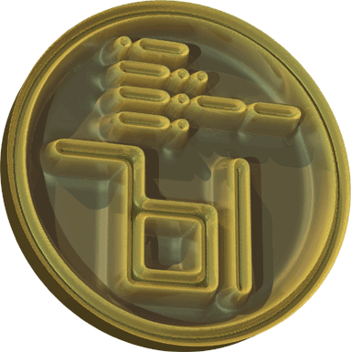

# The Toad's Slimy Mudhole

## where the Toad intercourses Python

| [POV-Ray Mosaic - turning 2D images into 3D solid objects mosaic](https://github.com/Dnyarri/POVmosaic "POV-Ray Mosaic source") | [img2mesh - PNG/PGM/PPM images to 3D triangle mesh converter](https://github.com/Dnyarri/img2mesh "img2mesh source") |
| ---- | ---- |
|  |  |

[dnyarri.github.io](https://dnyarri.github.io/ "The Toad's Slimy Mudhole - Python freeware for image editing, Scale2x, Scale3x, Scale2xSFX and Scale3xSFX, PyPNM, POV-Ray, etc.")
